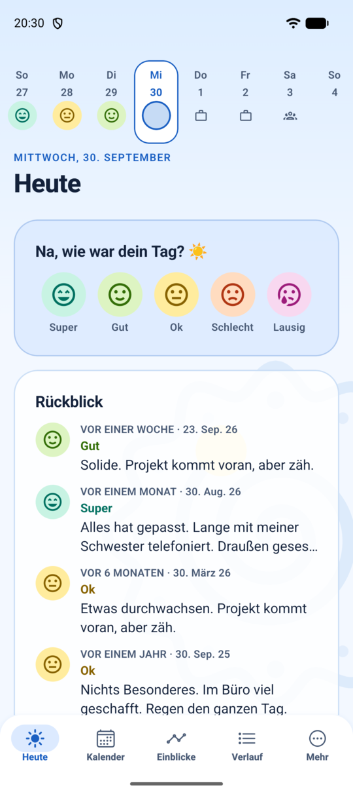
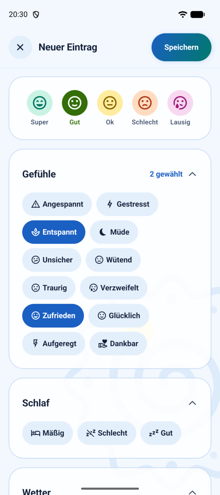
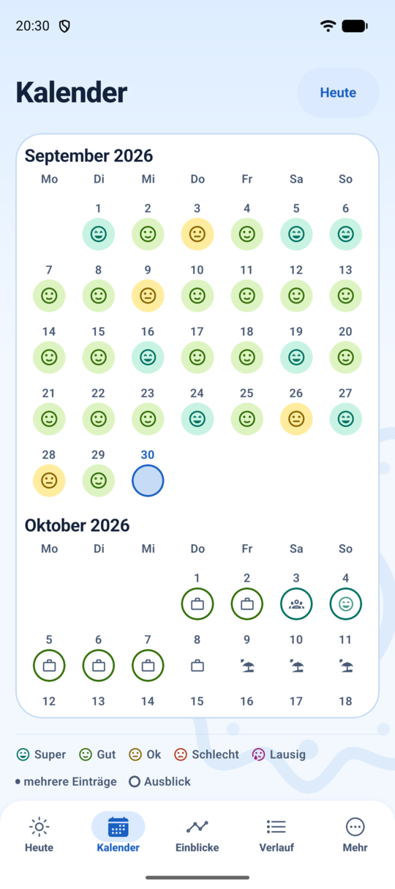
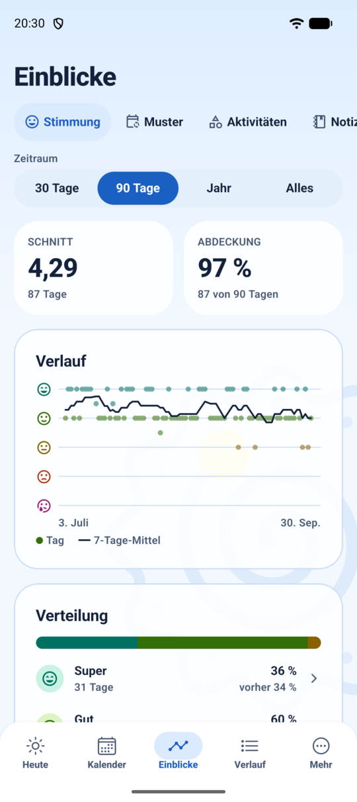
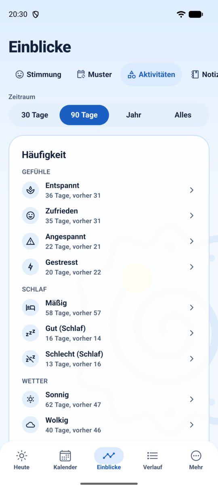
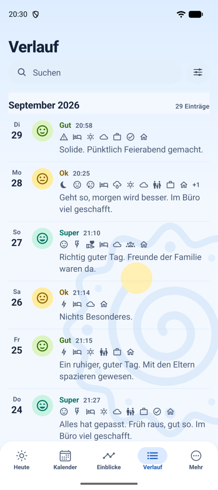

# Daylight

Ein Stimmungstagebuch für Android, das deine Daten nicht kennt. Keine Konten, keine Server, keine Analytics, keine Werbung und keine Internet-Berechtigung. Alles bleibt auf deinem Gerät.

<p align="center">
  
  
  
</p>
<p align="center">
  
  
  
</p>

<sub>Alle Screenshots zeigen die eingebauten Beispieldaten.</sub>

## Highlights

- 🔒 **Komplett offline.** Daylight hat keine Internet-Berechtigung. Deine Einträge liegen in einer Datenbank auf dem Gerät und verlassen es nur, wenn du selbst eine Sicherung teilst.
- ⚡ **In Sekunden eingetragen.** Stimmung antippen, Aktivitäten wählen, fertig. Notiz, eigene Skalen und ein Foto pro Tag sind optional.
- 📦 **Einfacher Umstieg.** Daylight übernimmt ein bestehendes Stimmungstagebuch aus einer anderen App vollständig, als CSV-Export oder als Sicherung mit Fotos. Exportieren kannst du auch wieder als CSV.
- 📊 **Einblicke in deine Muster.** Verlauf, Wochentage, Monate, Jahr in Pixeln, welche Aktivitäten mit besseren oder schlechteren Tagen zusammenfallen, was am Folgetag passiert, häufige Wörter in deinen Notizen. Immer als Beschreibung deiner Einträge, nie als Diagnose.
- 🔭 **Ein ehrlicher Ausblick.** Daylight schätzt die nächsten sieben Tage, aber nur dort, wo das auf deinen eigenen Daten nachweislich besser funktioniert als simples Raten. Sonst tritt der Ausblick zurück und sagt das auch.
- ❤️ **Gesundheitsdaten, wenn du willst.** Schritte, Schlaf, Ruhepuls und Training aus Health Connect, etwa von einer Smartwatch. Nur lesend und nur nach deiner Zustimmung.
- 🛡️ **Geschützt.** App-Sperre über die Displaysperre des Geräts, keine Screenshots bei aktiver Sperre, kein Android-Cloud-Backup. Eine Erinnerung am Abend verrät im Text nichts aus dem Tagebuch.

Die Oberfläche gibt es auf Deutsch und Englisch.

## Installieren

Die APK liegt bei jedem [Release](https://github.com/Jurgler95/daylight/releases/latest). Auf dem Handy herunterladen und öffnen; Android fragt einmalig, ob der Browser Apps installieren darf.

Jede APK ist mit demselben Schlüssel signiert. Wer das prüfen will, vergleicht den SHA-256-Fingerabdruck des Zertifikats (`apksigner verify --print-certs daylight-X.Y.Z.apk`):

```
9D:5E:FF:54:19:70:F6:09:85:7F:B6:F8:43:1C:E8:62:74:B4:6E:FB:2E:1B:56:A5:9B:63:CC:87:04:1F:C9:8A
```

Daylight ist kein Medizinprodukt und ersetzt keine Beratung oder Behandlung. Wem es länger schlecht geht: Die [Telefonseelsorge](https://www.telefonseelsorge.de/) ist unter 0800 111 0 111 rund um die Uhr erreichbar.

## Entwicklung

Setup, Architektur und Release-Ablauf stehen in [`docs/development.md`](docs/development.md). Pull Requests nehme ich in der Regel nicht an, Fehlermeldungen als Issue sind willkommen, siehe [`CONTRIBUTING.md`](CONTRIBUTING.md).

## Lizenz

Copyright © 2026 Paul Behla, [paul-behla.de](https://paul-behla.de).

Daylight ist freie Software unter der [GNU General Public License, Version 3 oder später](LICENSE), mit einer Zusatzbedingung nach Abschnitt 7(b): Wer die App oder eine darauf aufbauende Version weitergibt, muss den Vermerk „Basiert auf Daylight von Paul Behla (paul-behla.de)“ in der App sichtbar lassen, etwa auf dem Über-Screen. Der genaue Wortlaut steht in [`NOTICE`](NOTICE).
